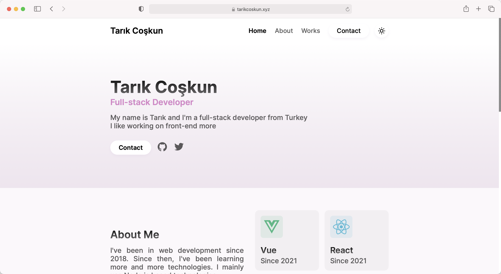

### 🌐 My Personal Website

### ✨ Features

- Built with [Next.js](https://nextjs.org), one of the most popular front-end frameworks!
- An easy to understand [config file](https://github.com/tarikcoskun/website/blob/master/web.config.tsx)!
- Dark or light mode support!
- Fully written in TypeScript!

### 📦️ Installation

[Node.js](https://nodejs.org/en/download) is required for this project to run. Node.js natively comes with npm, but I recommend using yarn over it, as it is faster. You can install yarn in your machine by using `npm install yarn -g` command.

- Install dependencies: `yarn` or `npm install`.
- Start the project:
  - in development mode: `yarn dev` or `npm run dev`,
  - in production mode: First, run `yarn build` or `npm run build` then run `yarn start` or `npm run start`.

### 🙏 Special Thanks

To [EGGSY](https://github.com/eggsy), [Arda](https://github.com/ardasoyturk), [Barış](https://github.com/barbarbar338), [Florian Lefebvre](https://github.com/florian-lefebvre) and [Harsh Singh](https://github.com/harshhhdev). Got inspired a lot by them, even used some of their amazing code. Make sure to check their profiles and websites 😉